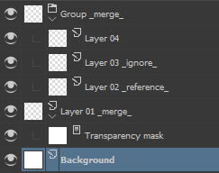

# Layer tags

You can use tags to automatically *merge* or *ignore* them when exporting, or set them as *reference* layers.

You just have to use the tag in the names of the layers. These are the available tags:

- `_merge_`: The layer or the group will be flattened. For a single layer, that means all transformation and transparency masks will be applied.
- `_ignore_`: The layer will not be exported and it will not be visible if it is in a merged group.
- `_reference_`: The layer will be set as a reference layer. That means it will be set to not be renderable in the destination application (e.g. *guide layer* in *After Effects*, *disabled in renderer* in *Blender*)

In this example:  
The group will be exported as a single layer with the *Layer 04* visible. *Layer 03* will not be visible. *Layer 02* will be visible only if the option *Export "_reference_" layers* is checked.  
*Layer 01* will be exported as a single layer with its transparency applied in the alpha chanel.