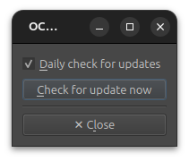

# OCA Plugin Settings

Click the ***⚙ Settings*** button in the OCA window to access the plugin settings.

By default, the plugin checks once a day if a new version is available. You can deactivate this in the settings.

Click the *"Check for update now"* button to manually check if a new version is available.
